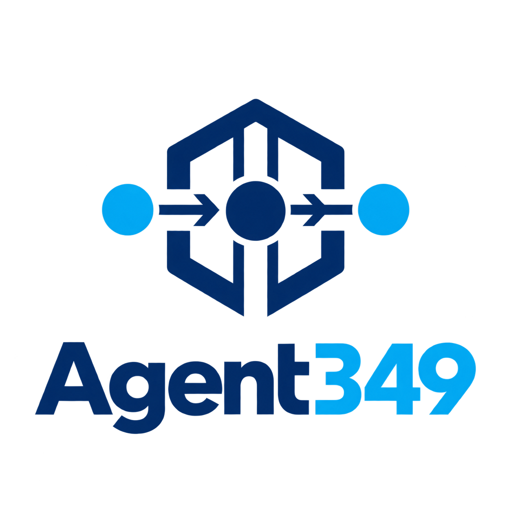
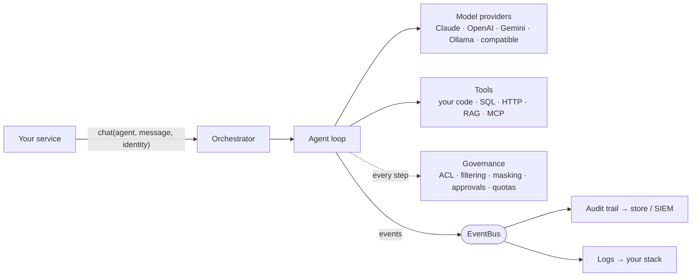
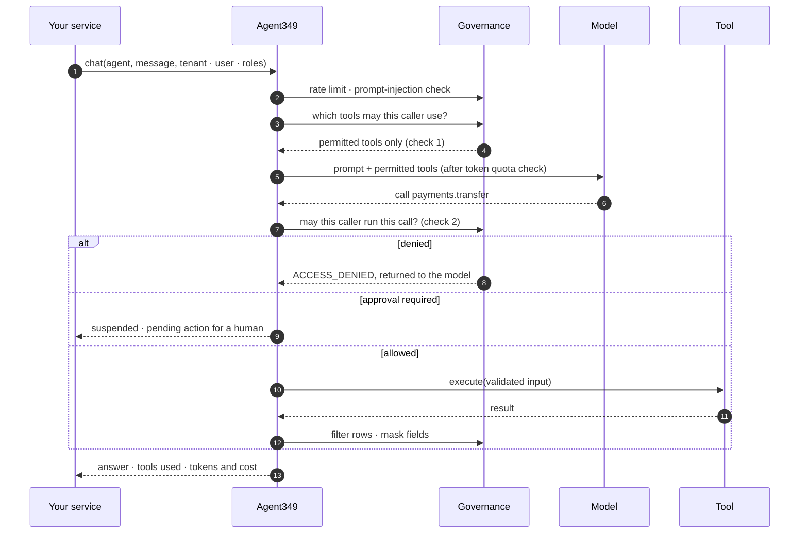
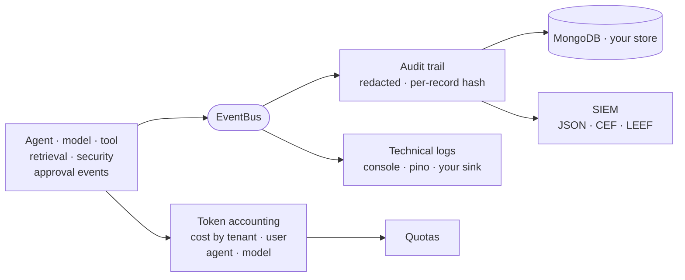

<p align="center">
  
</p>

<h1 align="center">Agent349</h1>

<p align="center">
  <strong>Governed AI agents for Node.js.</strong><br>
  Build, run and govern production AI agents, with access control, audit and human approval built into the runtime.
</p>

<p align="center">
  <a href="https://github.com/agent-349/agent349/actions/workflows/ci.yml"></a>
  <a href="LICENSE"></a>
  = 20">
  
</p>

<p align="center">
  <a href="docs/getting-started.md">Getting started</a> ·
  <a href="docs/architecture.md">Architecture</a> ·
  <a href="docs/README.md">Documentation</a> ·
  <a href="examples/">Examples</a>
</p>

---

Agent349 is a TypeScript library for running AI agents inside your own Node.js
services. It is aimed at enterprise and public-sector teams that have to answer
questions like these before an agent reaches production:

- _Who is allowed to make the agent do this?_
- _Can this user's agent see another tenant's data?_
- _Who approved that payment, and what did the model see?_
- _What did this conversation cost, and who is over budget?_

In Agent349 the answers are part of the runtime. Every call carries the caller's
identity (tenant, user, roles), and that identity drives tool permissions,
data filtering, retrieval scope, approvals, token quotas and the audit trail.
It runs in your process, with your storage and your model providers,
including local models, so it fits self-hosted and private deployments.

## Why Agent349

Most agent frameworks are built to get a prototype calling tools quickly.
Role-based access control, PII masking and audit are left to each application,
or to a separate hosted platform. That works for a demo. It is also the gap
that keeps agents out of production.

Agent349 is built for production constraints from day one. Control over what
an agent may do, a record of what it did, and a way to stop it for human review
are part of the runtime. They run in your own process, on your infrastructure.

|                                                 |                                                                                                                                                                                                                                                                                           |
| ----------------------------------------------- | ----------------------------------------------------------------------------------------------------------------------------------------------------------------------------------------------------------------------------------------------------------------------------------------- |
| **Access control that the model cannot bypass** | Tools a user may not use are never offered to the model, and every tool call is re-checked before it runs. Result rows are filtered by tenant or role, and sensitive fields are masked.                                                                                                   |
| **Human-in-the-loop that survives restarts**    | Approval triggers suspend the agent before a sensitive call, persist a checkpoint, notify approvers, escalate, and resume the conversation after a decision, even in another process.                                                                                                     |
| **An audit trail designed for compliance**      | Agent, model, tool, retrieval, security and approval events become structured audit records. They are redacted, stored in MongoDB or your own store, and can be forwarded to a SIEM as JSON, CEF or LEEF.                                                                                 |
| **Cost you can attribute and cap**              | Token usage and cost are recorded per tenant, user, agent, session, request, model, skill and tool, with daily and monthly quotas.                                                                                                                                                        |
| **Model independence**                          | Claude, OpenAI, Gemini, Ollama and any OpenAI-compatible endpoint behind one interface, with per-agent fallback, circuit breakers, multimodal input and structured output.                                                                                                                |
| **Integrations with guardrails**                | Configurable SQL, MongoDB, HTTP, web, feed, document, file and mail tools, where credentials and destinations are configuration and the model only fills the parameters you expose. Plus MCP servers, and retrieval (RAG) on pgvector, Qdrant, Weaviate, Milvus, Pinecone or Meilisearch. |

## Quick start

```bash
npm install agent349
```

An agent with a payment tool that only treasurers may use, and an audit trail
of everything that happened:

```ts
import { ACLService, Orchestrator, SecurityMiddlewareChain, ToolACLMiddleware } from 'agent349';
import type { Tool } from 'agent349';

const transfer: Tool = {
  name: 'payments.transfer',
  description: 'Transfers money between two accounts.',
  inputSchema: {
    type: 'object',
    properties: { from: { type: 'string' }, to: { type: 'string' }, amount: { type: 'number' } },
    required: ['from', 'to', 'amount'],
  },
  execute: async (input: { from: string; to: string; amount: number }) => ({
    success: true,
    data: { ...input, status: 'completed' },
  }),
};

// Uses ANTHROPIC_API_KEY from the environment; audit kept in memory for the demo.
const orch = await Orchestrator.create({ audit: { enabled: true } });

orch.registerTool(transfer);
orch.registerSkill({ name: 'payments', description: 'Payments', tools: [transfer] });
orch.registerAgent({
  id: 'treasury',
  name: 'Treasury assistant',
  systemPrompt: 'You execute payments the user asks for.',
  skills: ['payments'],
});

// Governance: only treasurers may transfer money.
const acl = new ACLService({
  policies: [
    { resourceType: 'tool', resourceId: 'payments.transfer', allowedRoles: ['treasurer'] },
  ],
});
orch.registerACLService(acl);
const chain = new SecurityMiddlewareChain(orch.events);
chain.use(new ToolACLMiddleware(acl));
orch.registerSecurityChain(chain);

// Same request, two users with different roles.
const ask = 'Transfer 500 USD from ACC-1 to ACC-2.';
await orch.chat('treasury', ask, { tenantId: 'acme', userId: 'ana', roles: ['analyst'] });
await orch.chat('treasury', ask, { tenantId: 'acme', userId: 'tom', roles: ['treasurer'] });

// Who did what, and with which outcome.
await orch.audit!.flush();
const { records } = await orch.audit!.query({
  tenantId: 'acme',
  category: ['tool', 'security'],
  dateRange: { from: new Date(Date.now() - 60_000), to: new Date() },
});
for (const r of records) console.log(r.userId, `${r.category}/${r.action}`, r.outcome);

await orch.shutdown();
```

To run it without an API key, clone the repository and run
`npm install && npm run example:quickstart`. A scripted model stands in for the
LLM, and the governance code is the same:

```text
Audit trail:
  tom  tool/call_end                      success
  tom  tool/call_start                    success
  ana  security/access_denied             blocked
```

Next: the [getting started guide](docs/getting-started.md).

## How it fits together



- **Agents** are serializable configuration: a system prompt, the skills they
  may use, and optional model settings.
- **Skills** group **tools** and define an agent's capability boundary.
- The **Orchestrator** builds everything from one configuration (JSON file or
  object, with `${ENV_VAR}` secrets). It exposes `chat()` for agents and
  `complete()` for direct model calls.
- Governance and observability are **cross-cutting**. They apply to every
  agent without changing agent code.

## How a request flows

Every `chat()` carries the caller's identity, and governance runs at each step:
access is checked **twice** (before the model sees the tools, and again before
any call runs), sensitive calls can wait for a person, and results are filtered
and masked before the model reads them.



Each of those steps is also an event. Three independent planes consume them:
a compliance audit trail, technical logs, and token accounting.



The [architecture overview](docs/architecture.md) has the full request
lifecycle, including memory, planning and resumed approvals, and the module
layout.

## Capabilities

| Area          | What you get                                                                                                                                                                                                                                              |
| ------------- | --------------------------------------------------------------------------------------------------------------------------------------------------------------------------------------------------------------------------------------------------------- |
| Orchestration | Agent loop with tool calling, iteration limits, optional planning step, streaming, cancellation, stateless mode, host-initiated tool execution                                                                                                            |
| Models        | Claude, OpenAI, Gemini, Ollama, OpenAI-compatible endpoints. Named instances, per-agent fallback, circuit breaker, images/documents/audio/video input, JSON Schema output, provider files and batch jobs                                                  |
| Security      | Role- and condition-based ACL for tools and skills, pre-execution re-check, tenant/role data filtering, field masking, prompt-injection patterns, rate limits, untrusted-content tracking                                                                 |
| Approvals     | Triggers on tool, input or caller context. Persisted suspend/resume, escalation levels, expiration, notification channels, atomic claims across processes                                                                                                 |
| Audit         | Structured records with verbosity levels, redaction, integrity hash, retention, JSON/CSV/SIEM export, live SIEM forwarding, MongoDB or custom store                                                                                                       |
| Observability | EventBus with wildcard subscriptions, pluggable technical logger, token and cost accounting, per-tenant and per-user quotas, per-request reports                                                                                                          |
| Knowledge     | Retrieval pipeline: text/Markdown/HTML/PDF/DOCX ingestion, OpenAI/Cohere/Ollama embeddings, PostgreSQL/pgvector, Qdrant, Weaviate, Milvus, Pinecone or Meilisearch vector stores (or in-memory), hybrid search, LLM/Cohere/TEI reranking, query rewriting |
| Memory        | Session history with sliding-window or summary compression, long-term user facts. In-memory, Redis or MongoDB storage                                                                                                                                     |
| Integrations  | SQL (PostgreSQL, MySQL/MariaDB, SQL Server, Oracle), MongoDB, HTTP APIs, web pages, RSS/Atom feeds, documents, files, mail. MCP client (stdio and HTTP)                                                                                                   |
| Extensibility | Abstract classes for providers, storage, vector stores, embeddings, rerankers, loaders, audit stores, SIEM forwarders, loggers, approval stores, notification channels, credentials and security middleware                                               |

## Documentation

|                                            |                                                                                                          |
| ------------------------------------------ | -------------------------------------------------------------------------------------------------------- |
| [Getting started](docs/getting-started.md) | Install, first agent, tools, governance                                                                  |
| [Architecture](docs/architecture.md)       | Components, request lifecycle, cross-cutting concerns                                                    |
| [Configuration](docs/configuration.md)     | Sections, defaults, a production-shaped example                                                          |
| [Guides](docs/README.md#guides)            | Agents, providers, memory, RAG, security, approvals, audit, observability, MCP, integrations, deployment |
| [Examples](examples/)                      | Runnable examples                                                                                        |

Every code sample in the English documentation is type-checked against the
sources in CI. Complete reference manuals written during development are
available in [Spanish](docs/es/README.md).

## Security

- The model never sees credentials, hosts or connection details. Integration
  tools take them from configuration or from your `CredentialProvider`.
- Access decisions, masking and denials are recorded in the audit trail when
  audit is enabled.
- Agent349 does not authenticate users. Your application does, and passes the
  identity to every call.

Please report vulnerabilities privately, as described in [SECURITY.md](SECURITY.md).

## Deployment

Agent349 is a library. There is no server to run and no hosted component. It
runs wherever Node.js 20+ runs: containers, VMs, serverless functions or
on-premises servers. For more than one instance, point sessions, memory, tokens,
approvals and audit at shared Redis or MongoDB. See the
[deployment guide](docs/guides/deployment.md).

## How it compares

Several good TypeScript libraries build agents. They differ in where they draw
the line between the library, your application and a hosted platform. This
table compares documented approaches, not quality. Check each project's
documentation for current details.

|                         | Agent349                                                                                              | LangChain.js / LangGraph.js                                                                              | Vercel AI SDK                                                                                       |
| ----------------------- | ----------------------------------------------------------------------------------------------------- | -------------------------------------------------------------------------------------------------------- | --------------------------------------------------------------------------------------------------- |
| Orchestration model     | Agent loop over skills and tools                                                                      | Graphs of deterministic and agentic steps (LangGraph)                                                    | Tool-loop agents and core generate/stream functions                                                 |
| Model abstraction       | Yes                                                                                                   | Yes                                                                                                      | Yes                                                                                                 |
| Human-in-the-loop       | Trigger-based approvals, persisted by the SDK, with escalation and expiration                         | Interrupts with persistence (checkpointers)                                                              | Tool approval requests; approval state kept by the application in the message history; OPA policies |
| Authorization           | In-process, in the open-source library: role/condition-based tool ACL, data filtering, field masking¹ | Auth handlers in LangSmith Deployment only; not available to the open-source library on your own server² | Not a documented library feature                                                                    |
| Audit and observability | Audit records with redaction and SIEM forwarding, EventBus, token cost and quotas                     | Tracing and debugging with LangSmith                                                                     | Telemetry built on OpenTelemetry                                                                    |
| Retrieval (RAG)         | Built-in ingestion, vector stores, hybrid search, reranking                                           | Extensive loaders, vector stores and retrievers                                                          | Embedding and reranking functions                                                                   |
| MCP                     | Client                                                                                                | Supported                                                                                                | Supported                                                                                           |
| Where it runs           | Your process, on your infrastructure; no hosted component                                             | Your process; LangSmith is a hosted platform with an enterprise self-hosted option                       | Your process                                                                                        |

¹ Enforced inside your process: prompts, tool results and audit records stay on
your infrastructure, with no external platform in the path.

² LangChain's documentation: custom auth "does not apply to isolated usage of
the LangGraph open source library in your own custom server"
([source](https://docs.langchain.com/langsmith/custom-auth)).

Other frameworks such as [Mastra](https://mastra.ai) combine agents, workflows
with suspend/resume, RAG and tracing.

Choose Agent349 when identity-aware governance (who may call what, see what,
approve what, and spend what) must be enforced inside the agent runtime and
kept on your own infrastructure. If you need a large ecosystem of third-party
integrations or graph-shaped workflows first, the alternatives above may fit
better.

## Project status

Agent349 runs in production and is moving toward 1.0. The core APIs are
covered by more than 2,700 unit tests, plus contract tests that run every
vector store adapter against its real database. Until 1.0, a minor release may
include breaking changes; each one is listed in the [changelog](CHANGELOG.md)
with migration notes.

## Contributing

Contributions are welcome. [CONTRIBUTING.md](CONTRIBUTING.md) explains the
development setup, conventions and pull-request process. Everyone
participating is expected to follow the [Code of Conduct](CODE_OF_CONDUCT.md).

## License

[Apache License 2.0](LICENSE).
