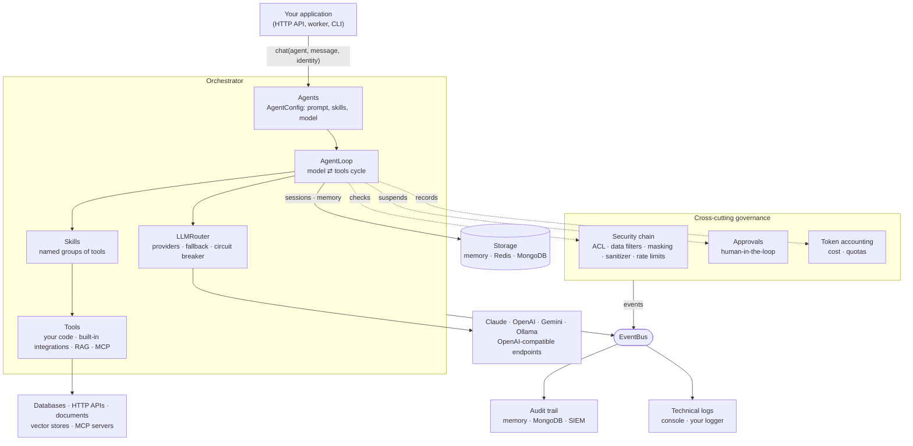
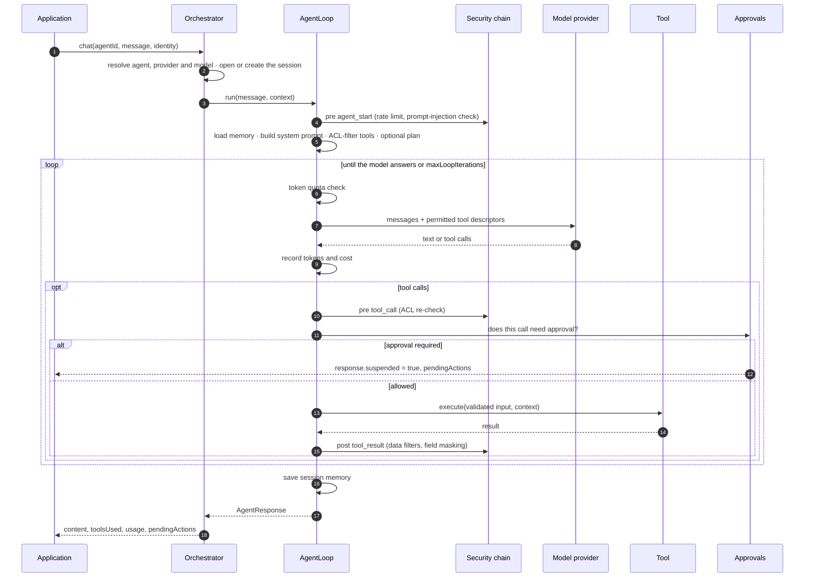
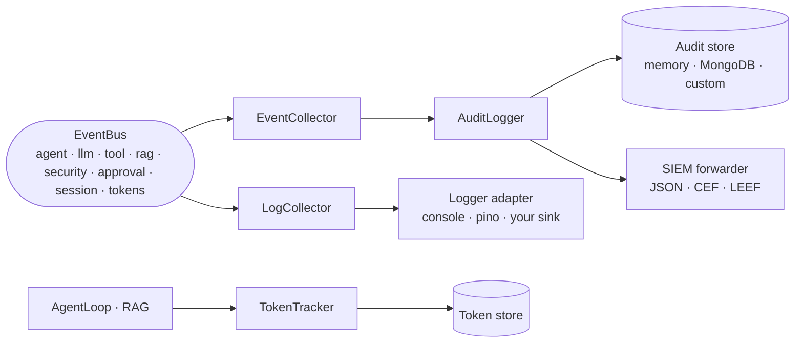

# Architecture

Agent349 is a library, not a service. It runs inside your Node.js process, uses
the storage you point it at, and talks to the model providers you configure.
There is no hosted component and no outbound connection other than the ones your
configuration declares.

## The building blocks



| Concept              | What it is                                                                                                                                                                                                                                       |
| -------------------- | ------------------------------------------------------------------------------------------------------------------------------------------------------------------------------------------------------------------------------------------------ |
| **Orchestrator**     | The entry point. Builds every component from configuration, owns their lifecycle (`shutdown()`), and exposes `chat()`, `complete()` and the registries.                                                                                          |
| **Agent**            | A serializable `AgentConfig`: system prompt, skills, optional model settings, memory strategy and iteration limit. Agents hold no code.                                                                                                          |
| **Skill**            | A named group of tools plus an optional system-prompt addition. An agent can only reach the tools of the skills it declares. That list is its capability boundary.                                                                               |
| **Tool**             | An object with a JSON Schema and an async `execute`. Your own functions, the built-in integration tools (SQL, MongoDB, HTTP, web, feeds, documents, files, mail), `rag.search`, and tools bridged from MCP servers are all the same `Tool` type. |
| **AgentLoop**        | Runs one turn: calls the model, executes the tools it asks for, feeds the results back, and repeats until the model answers or the iteration limit is reached.                                                                                   |
| **LLMRouter**        | Holds named provider instances, applies a circuit breaker per instance and an optional per-agent fallback provider.                                                                                                                              |
| **ExecutionContext** | The caller's identity (tenant, user, roles) plus session and request IDs. It is created per call and passed to every component.                                                                                                                  |
| **EventBus**         | In-process pub/sub. Every component reports what it does as events. Audit, logging and token accounting are consumers of those events.                                                                                                           |

## What happens during `chat()`



Two details matter for governance:

- **Access control runs twice.** Tools the caller may not use are removed
  before the model sees them. Every tool call the model makes is checked again
  right before it executes, which also covers a call to a tool that was never
  offered.
- **A denied or failed tool call is not an exception.** It goes back to the
  model as a tool result, so the model can explain the refusal or correct
  its input. Blocking at the agent level (rate limit, high-risk prompt
  injection) throws `AccessDeniedError`.

## Cross-cutting concerns

### Identity and authorization

Agent349 does not authenticate users. Your application does, and passes the
result to `chat()` as `{ tenantId, userId, roles }`. From there, authorization
is enforced by the security chain:

| Layer               | Component                                           | Acts on                                                                                         |
| ------------------- | --------------------------------------------------- | ----------------------------------------------------------------------------------------------- |
| Tool and skill ACL  | `ACLService`, `ToolACLMiddleware`                   | Which tools the model is offered and may call                                                   |
| Data filtering      | `DataFilterMiddleware`                              | Which records of a tool result the caller may see: tenant isolation, role-based or custom rules |
| Field masking       | `FieldMaskMiddleware`                               | Which fields are redacted, partially masked or hashed                                           |
| Retrieval filtering | `RAGFilter` from the ACL                            | Which documents a search can return                                                             |
| Input checks        | `InputSanitizerMiddleware`, `RateLimiterMiddleware` | Prompt-injection patterns and request rates                                                     |

See [Security and access control](guides/security.md).

### Secrets and credentials

Configuration references secrets as `${ENV_VAR}`, resolved at load time.
Integration tools never expose credentials, hosts or connection details to the
model. Those come from configuration or from a `CredentialProvider` you
implement (for OAuth, rotation or per-user credentials). The model only
supplies the parameters a tool declares as model-provided. See
[Integration tools](guides/integration-tools.md).

### Events, audit and observability

Everything observable flows through the EventBus. Three consumers turn events
into three separate planes, each with its own retention and audience:



| Plane            | Purpose                                          | Enabled by                              |
| ---------------- | ------------------------------------------------ | --------------------------------------- |
| Audit            | Who did what, with which outcome, for compliance | `audit.enabled`                         |
| Technical logs   | Debugging and operations                         | `logging.adapter` or an injected logger |
| Token accounting | Cost attribution and quotas                      | On by default (`tokens.limitMode`)      |

`orch.observability` combines them. For example, `getRequestReport(requestId)`
returns the cost and the audit trail of one request in a single call. See
[Observability](guides/observability.md) and [Audit trail](guides/audit.md).

### Human in the loop

An `ApprovalService` with triggers (always, by input value, by caller
context, or custom) suspends the loop before a sensitive tool runs. The
conversation is checkpointed, the pending action is stored and notified, and
`orch.approve()` later executes the tool and resumes the agent, possibly in
another process. See [Human-in-the-loop](guides/human-in-the-loop.md).

### Model independence

Agents name a provider **instance**, not a vendor SDK. Instances are declared in
configuration: Claude, OpenAI, Gemini, Ollama, and any OpenAI-compatible
endpoint (vLLM, gateways). Each instance has its own credentials, timeouts,
pricing, token accounting and circuit breaker. Content (text, images,
documents, audio, video), tool calling and structured output go through one
normalized model. Each provider declares its capabilities, so an unsupported
request fails with a clear error instead of being silently degraded. See
[LLM providers](guides/llm-providers.md).

## Module layout

```text
src/
├── core/           Orchestrator, AgentLoop, Planner
├── llm/            Providers, LLMRouter, structured output (gemini/ for Gemini)
├── content/        Content blocks and helpers (text, images, documents…)
├── tools/          ToolRegistry, ToolExecutor, built-in integration tools
├── skills/         SkillRegistry
├── connections/    Named connections shared by integration tools
├── credentials/    CredentialProvider and static credentials
├── memory/         Session and long-term memory, storage adapters
├── session/        SessionManager
├── rag/            Ingestion, embeddings, vector stores, rerankers, rag.search
├── mcp/            MCP client and tool bridge
├── security/       ACL, data filters, masking, sanitizer, rate limiter, middleware
├── approval/       ApprovalService, triggers, escalation, notification, stores
├── audit/          AuditLogger, stores, SIEM forwarders, integrity hash
├── tokens/         TokenTracker, pricing
├── logging/        LogCollector, logger adapters
├── observability/  Observability façade
├── events/         EventBus
├── config/         ConfigLoader, declarative tools/skills/agents
├── errors/         Error classes
└── types/          Shared types
```

Dependencies point inward: `types/` and `errors/` depend on nothing, `events/`
only on `types/`, feature modules on those, and `core/Orchestrator` is the only
place that wires everything together. Modules that need to react to each other
communicate through the EventBus.

## Extension points

Every infrastructure dependency sits behind an abstract class you can
implement and inject:

| Extend                                                          | To plug in                                              |
| --------------------------------------------------------------- | ------------------------------------------------------- |
| `LLMProvider` (+ `FileCapableProvider`, `BatchCapableProvider`) | Another model API                                       |
| `StorageAdapter`                                                | Another key-value store for sessions, memory and tokens |
| `VectorStoreAdapter`, `EmbeddingProvider`, `RerankerProvider`   | Another vector database, embedding model or reranker    |
| `DocumentLoader`                                                | Another document format for ingestion                   |
| `AuditStoreAdapter`, `SIEMForwarder`                            | Another audit database or security pipeline             |
| `LoggerAdapter`                                                 | Your logging stack                                      |
| `PendingActionStore`, `NotificationChannel`                     | Where approvals are kept and how approvers are notified |
| `CredentialProvider`                                            | OAuth, secret managers, per-user credentials            |
| `SecurityMiddleware`                                            | Your own pre/post checks                                |
