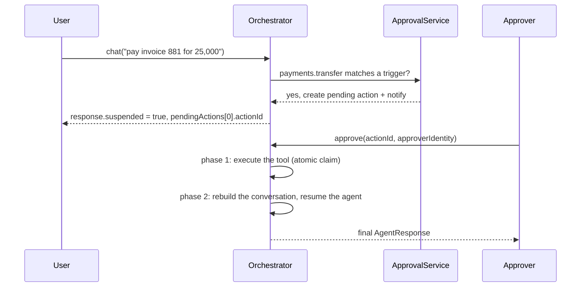

# Human-in-the-loop approvals

Some tool calls should not run until a person agrees: a large payment, an
outbound email, a deletion. Agent349 **suspends** the agent before such a call,
stores a checkpoint, notifies approvers, and resumes the conversation after a
decision, possibly hours later and in another process.

## Flow



Status lifecycle:

```text
pending → executing → tool_completed → resuming → completed
                                            └→ resume_failed   (retryResume)
        ↳ failed (the tool threw)
rejected · expired · cancelled   (terminal)
```

## Setup

```ts
import {
  ApprovalNotifier,
  ApprovalService,
  EventChannel,
  InMemoryPendingStore,
  ToolExecutor,
} from 'agent349';

const approvalService = new ApprovalService(
  new InMemoryPendingStore(), // use MongoPendingActionStore with more than one process
  new ApprovalNotifier([new EventChannel(orch.events)]),
  new ToolExecutor(orch.toolRegistry, orch.events),
  orch.events,
  { defaultTimeoutMinutes: 60 },
);

approvalService.addTrigger({
  id: 'large-transfer',
  name: 'Transfers above 10,000',
  enabled: true,
  scope: { tools: ['payments.transfer'] },
  conditions: [{ type: 'input_field', field: 'amount', operator: 'gt', value: 10_000 }],
  approvalConfig: { approverRoles: ['treasurer'], risk: 'high', timeoutMinutes: 120 },
  description: 'Large transfers need a treasurer',
});

orch.registerApprovalService(approvalService);
```

Trigger conditions:

| `type`          | Matches on                                                                                           |
| --------------- | ---------------------------------------------------------------------------------------------------- |
| `always`        | Every call in scope                                                                                  |
| `input_field`   | A field of the tool input (`eq`, `neq`, `gt`, `gte`, `lt`, `lte`, `in`, `not_in`, `exists`, `regex`) |
| `context_field` | A field of the caller's context, e.g. `roles`                                                        |
| `custom`        | Your function `(toolName, input, context) => boolean`                                                |

`scope` can target tools by name or skills by prefix. A tool's
`requiresApproval` flag is metadata only: **nothing is suspended unless a
trigger matches.**

## Deciding

```ts
import type { ApprovalService, ExecutionContext } from 'agent349';

declare const approvalService: ApprovalService; // the service created above
declare const approverContext: ExecutionContext; // the authenticated approver

const response = await orch.chat('treasury', 'Pay invoice 881: 25,000 USD to ACME.', identity);

if (response.suspended) {
  const { actionId, toolName, risk, expiresAt } = response.pendingActions![0]!;
  // Persist actionId and show the request in your approval UI.

  // Later, when a treasurer approves:
  const final = await orch.approve(
    actionId,
    { tenantId: 'acme', userId: 'tom', roles: ['treasurer'] },
    { comment: 'Matches PO 2291' },
  );
  console.log(final.content); // the agent's answer after the tool ran

  // Or rejects (nothing to resume):
  await approvalService.reject(actionId, approverContext, { comment: 'Duplicate invoice' });
}
```

`approve()` and `reject()` authorize the approver. The approver must belong to
the action's tenant and hold one of its `approverRoles`, or be listed in
`approverUsers`. `'*'` admits any role. Escalation updates `approverRoles`, so
after escalating, the new level's roles are the ones that count. An
unauthorized caller gets an `AccessDeniedError`, the action stays pending, and
the attempt is audited as `security/approval_denied`. `orch.retryResume()`
requires the same tenant but no approver role, so operators can recover a
failed resume.

If your application already authorizes approvers itself, you can turn the check
off with `new ApprovalService(…, { authorizeApprovers: false })`.

The claim on the action is atomic, so two concurrent approvals cannot execute
the tool twice.

If the tool ran but resuming the agent failed (the process restarted, or the
model timed out), the action ends in `resume_failed` and emits
`approval.resume_failed`. `orch.retryResume(actionId, identity)` resumes
without executing the tool again.

## Notifications and escalation

`ApprovalNotifier` sends each new pending action to its channels.
`EventChannel` publishes on the EventBus. For Slack, Teams, email or your own
backend, extend `NotificationChannel`.

Triggers can escalate to other roles when nobody answers:

```ts nocheck
approvalConfig: {
  approverRoles: ['treasurer'],
  risk: 'high',
  timeoutMinutes: 240,
  escalation: {
    levels: [
      { level: 1, afterMinutes: 30, approverRoles: ['cfo'], notificationChannels: ['event'] },
      { level: 2, afterMinutes: 120, approverRoles: ['ceo'], notificationChannels: ['event'] },
    ],
  },
},
```

The SDK does not start timers. Call `approvalService.processEscalations()` and
`approvalService.processExpirations()` from your scheduler (cron, a job queue, a
managed interval). An action that nobody decides becomes `expired` at
`expiresAt`.

## Messages and localization

While a run is suspended, the SDK produces a few texts of its own: the reply
returned to the user, and notes the model sees for pending or skipped calls.
They default to English. Override any of them, for example to localize them:

```ts
import { ApprovalNotifier, ApprovalService, InMemoryPendingStore, ToolExecutor } from 'agent349';

const approvalService = new ApprovalService(
  new InMemoryPendingStore(),
  new ApprovalNotifier([]),
  new ToolExecutor(orch.toolRegistry, orch.events),
  orch.events,
  {
    messages: {
      suspendedSingle: "La acción '{toolName}' requiere aprobación humana antes de continuar.",
      suspendedMultiple: '{count} acciones requieren aprobación humana antes de continuar.',
    },
  },
);
```

Placeholders such as `{toolName}`, `{count}`, `{goal}` and `{steps}` are filled
in. `DEFAULT_APPROVAL_MESSAGES` lists every message with its English text.

## Production

- Use `MongoPendingActionStore` (`await MongoPendingActionStore.create({ uri, database })`)
  so pending actions survive restarts and are shared by every instance.
- Enable audit: approvals, rejections and executions are recorded with the
  approver's identity.
- Checkpoints hold the conversation. Large media is omitted by default, and
  `maxSnapshotBytes` bounds their size.

The Spanish [HITL production guide](../es/HITL_MANUAL.md) covers the MongoDB
setup, REST integration, scheduling and operations in detail.
