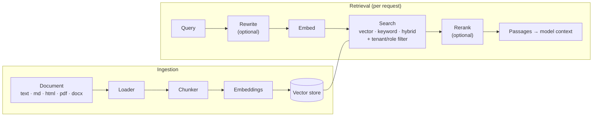

# Retrieval (RAG)

Agent349 includes a retrieval pipeline so agents can answer from your
documents: ingestion into collections, then vector, keyword or hybrid search
with optional query rewriting and reranking. Agent searches are always scoped
to the caller's tenant and roles.



| Component       | Built-in options                                                                             |
| --------------- | -------------------------------------------------------------------------------------------- |
| Vector store    | `in-memory` (default), `pgvector`, `qdrant`, `weaviate`, `milvus`, `pinecone`, `meilisearch` |
| Embeddings      | OpenAI, Cohere, Ollama                                                                       |
| Rerankers       | `llm` (any configured model), `cohere`, `tei` (Hugging Face Text Embeddings Inference)       |
| Query rewriting | `contextual` (resolves references from the conversation), `hyde`                             |
| Loaders         | plain text, Markdown, HTML, PDF, DOCX                                                        |

All of them are abstract classes you can extend (`VectorStoreAdapter`,
`EmbeddingProvider`, `RerankerProvider`, `DocumentLoader`).

## Configuration

```json config
{
  "rag": {
    "vectorStore": {
      "adapter": "meilisearch",
      "meilisearch": {
        "url": "${MEILI_URL}",
        "apiKey": "${MEILI_API_KEY}",
        "requestTimeout": 15000
      }
    },
    "embedding": {
      "defaultProvider": "openai",
      "defaultModel": "text-embedding-3-small",
      "defaultDimensions": 1536,
      "providers": { "openai": { "apiKey": "${OPENAI_API_KEY}" } }
    },
    "retrieval": {
      "searchMode": "hybrid",
      "hybridAlpha": 0.7,
      "topK": 15,
      "finalTopK": 5,
      "rerank": true,
      "rerankPolicy": "degrade"
    },
    "reranker": {
      "provider": "llm",
      "llmProvider": "claude",
      "model": "claude-haiku-4-5"
    }
  }
}
```

`orch.rag` is built lazily from this section on first access.

## Choosing a vector store

Every store implements the same `VectorStoreAdapter` contract. Tenant and role
scoping, tag, document, language and date filters, idempotent upserts, metadata
updates without re-embedding and bulk deletes behave identically on all of
them. The same test suite runs against each engine
([`tests/fixtures/vectorStoreContract.ts`](../../tests/fixtures/vectorStoreContract.ts)).
They differ in how they rank text and in a few limits:

| Adapter       | Engine                       | Keyword search                 | Hybrid search            | `filter.metadata` | Needs            |
| ------------- | ---------------------------- | ------------------------------ | ------------------------ | ----------------- | ---------------- |
| `in-memory`   | Process memory (development) | Token overlap                  | RRF                      | ✅                | —                |
| `pgvector`    | PostgreSQL + pgvector        | PostgreSQL full-text search    | RRF                      | ✅                | `npm install pg` |
| `qdrant`      | Qdrant, Qdrant Cloud         | BM25 (sparse vectors with IDF) | RRF                      | ✅                | —                |
| `weaviate`    | Weaviate, Weaviate Cloud     | Native BM25                    | Native (`alpha`)         | ❌                | —                |
| `milvus`      | Milvus 2.5+, Zilliz Cloud    | Native BM25 function           | RRF                      | ✅                | —                |
| `pinecone`    | Pinecone                     | ❌                             | ❌                       | ❌                | —                |
| `meilisearch` | Meilisearch                  | Native full-text               | Native (`semanticRatio`) | ignored           | —                |

Qdrant, Weaviate, Milvus and Pinecone are reached over their REST APIs, so they
need no client library. Unsupported operations fail with an explicit
`RAGError` instead of silently returning degraded results.

**pgvector.** Each collection is a table (`agent349_<collection>`) with an HNSW
index for the collection's metric (up to 2,000 dimensions; larger vectors are
searched exactly) and a generated `tsvector` column. The adapter runs
`CREATE EXTENSION IF NOT EXISTS vector` unless `createExtension` is `false`.
`textSearchConfig` (`simple`, `english`, `spanish`…) is fixed per collection
when it is created.

```json config
{
  "rag": {
    "vectorStore": {
      "adapter": "pgvector",
      "pgvector": {
        "connectionString": "${DATABASE_URL}",
        "schema": "public",
        "textSearchConfig": "english"
      }
    }
  }
}
```

**Qdrant.** One Qdrant collection per SDK collection, with a dense vector and a
BM25 sparse vector. Point IDs are deterministic UUIDs derived from chunk IDs.

```json config
{
  "rag": {
    "vectorStore": {
      "adapter": "qdrant",
      "qdrant": { "url": "${QDRANT_URL}", "apiKey": "${QDRANT_API_KEY}" }
    }
  }
}
```

**Weaviate.** One class per collection, named `Agent349_<collection>`
(collection names may use letters, digits, `_` and `-`). Stop words are
disabled so filters match tags and roles exactly. Custom metadata is stored
but not filterable.

```json config
{
  "rag": {
    "vectorStore": {
      "adapter": "weaviate",
      "weaviate": { "url": "${WEAVIATE_URL}", "apiKey": "${WEAVIATE_API_KEY}" }
    }
  }
}
```

**Milvus.** One collection per SDK collection, with a dense vector and a
sparse field filled by Milvus's BM25 function. Collections are created with
`Strong` consistency, so a write is visible to the next search; set
`consistencyLevel: "Bounded"` for higher ingestion throughput.

```json config
{
  "rag": {
    "vectorStore": {
      "adapter": "milvus",
      "milvus": { "url": "${MILVUS_URL}", "token": "${MILVUS_TOKEN}" }
    }
  }
}
```

**Pinecone.** All collections share one index (one namespace each), so they
share its dimension and metric. The index must exist, or `createIndex` creates
a serverless one on first use. Pinecone ranks by vector only: set
`searchMode: "vector"`, which the configuration loader enforces, and pass
`searchMode: "vector"` in direct `orch.rag.search()` calls. Serverless indexes
cannot delete or update by metadata filter, so `removeDocumentsByFilter()` and
`updateDocumentsMetadata()` scan the collection's namespace. Their cost grows
with its size.

```json config
{
  "rag": {
    "vectorStore": {
      "adapter": "pinecone",
      "pinecone": {
        "apiKey": "${PINECONE_API_KEY}",
        "indexName": "agent349",
        "createIndex": { "cloud": "aws", "region": "us-east-1" }
      }
    },
    "retrieval": { "searchMode": "vector" }
  }
}
```

**Your own store.** Extend `VectorStoreAdapter` and inject it with
`Orchestrator.create(config, { vectorStore: new MyStore() })`. An injected
store takes precedence over `rag.vectorStore`, and its lifecycle stays with
you. Stores built from configuration are closed by `orch.shutdown()`.

`rag.retrieval` settings are the defaults of the `rag.search` tool. A direct
`orch.rag.search()` call uses the values in its query, with `hybrid` as the
default mode.

## Ingestion

```ts
await orch.rag.createCollection('hr-policies', {
  embeddingProvider: 'openai',
  // "<provider>/<model>": queries embed with the provider named before the slash.
  embeddingModel: 'openai/text-embedding-3-small',
  dimensions: 1536,
  distanceMetric: 'cosine',
});

// A whole directory, visible to every employee of the tenant.
await orch.rag.ingestDirectory('./knowledge/hr', 'hr-policies', {
  extensions: ['.pdf', '.md', '.docx'],
  metadata: { tenantId: 'acme', accessRoles: ['employee'] },
});

// One restricted document, replacing any previous version with the same documentId.
await orch.rag.ingest('./knowledge/salary-bands.pdf', 'hr-policies', {
  metadata: {
    documentId: 'salary-bands',
    tenantId: 'acme',
    accessRoles: ['hr_admin'],
  },
  overwriteExisting: true,
});
```

- Always set `tenantId`, and `accessRoles` where access differs. Documents with
  no `accessRoles` are visible to everyone in the tenant.
- A stable `documentId` makes re-ingestion replace the old chunks instead of
  duplicating them. Content hashing also skips unchanged content.
- A collection is bound to one embedding model, written as
  `<provider>/<model>`. Searches embed the query with the provider named before
  the slash. Changing the model means re-ingesting into a new collection.

## Giving agents access

`rag.search` is a regular tool. Create one bound to your collections and put it
in a skill:

```ts
import { createRAGTool } from 'agent349';

const searchPolicies = createRAGTool(orch.rag.pipeline, ['hr-policies']);
orch.registerTool(searchPolicies);
orch.registerSkill({
  name: 'hr-knowledge',
  description: 'Search HR policies',
  tools: [searchPolicies],
  systemPromptAddition: 'Answer policy questions only from search results, and cite them.',
});
orch.registerAgent({
  id: 'hr-assistant',
  name: 'HR assistant',
  systemPrompt: 'You answer questions about company policies.',
  skills: ['hr-knowledge'],
});
```

It can also be declared in configuration as an internal tool:
`{ "name": "rag.search", "kind": "internal", "ref": "rag.search", "config": { "collections": ["hr-policies"] } }`.

## Searching directly

```ts
const result = await orch.rag.search(
  {
    query: 'remote work policy',
    collections: ['hr-policies'],
    topK: 10,
    finalTopK: 4,
    searchMode: 'hybrid',
    hybridAlpha: 0.6,
    rerank: true,
    // Direct searches are not scoped automatically: pass the caller's scope.
    filters: { tenantId: context.tenantId, accessRoles: context.roles },
  },
  context,
);

for (const p of result.passages)
  console.log(p.collection, p.score.toFixed(3), p.content.slice(0, 80));
console.log('latency', result.metrics.totalLatencyMs, 'ms');
```

## Access control

When an agent searches through the `rag.search` tool, the tool adds the
caller's `tenantId` and roles from the `ExecutionContext` to the vector-store
filter. The model cannot override them. Two users asking the same question can
get different passages.

When your code calls `orch.rag.search()` directly, it is trusted code and no
scope is added. Pass `filters: { tenantId, accessRoles }` yourself, as in the
example above.

Who may search at all is ordinary tool ACL:

```ts nocheck
acl.addPolicy({ resourceType: 'tool', resourceId: 'rag.search', allowedRoles: ['employee'] });
```

## Tuning notes

- `hybrid` suits most corporate content. Use `keyword`, or a low `hybridAlpha`,
  for codes, IDs and proper names.
- Without a reranker, scores are normalized per collection (the best candidate
  is always 1.0), so `minScore` cannot tell "no relevant result" apart from
  "some result". Enable a reranker if that distinction matters.
- `rerankPolicy: "require"` fails the search when the reranker is down.
  `"degrade"` falls back to un-reranked results. Call
  `orch.rag.validateReranker()` at startup to catch configuration errors early.
- Embeddings and LLM reranking are recorded in token accounting, attributed to
  `rag.ingest` and `rag.search`.

For chunking strategies, loaders, metadata updates and multi-collection search,
see the Spanish [RAG manual](../es/RAG_MANUAL.md).
