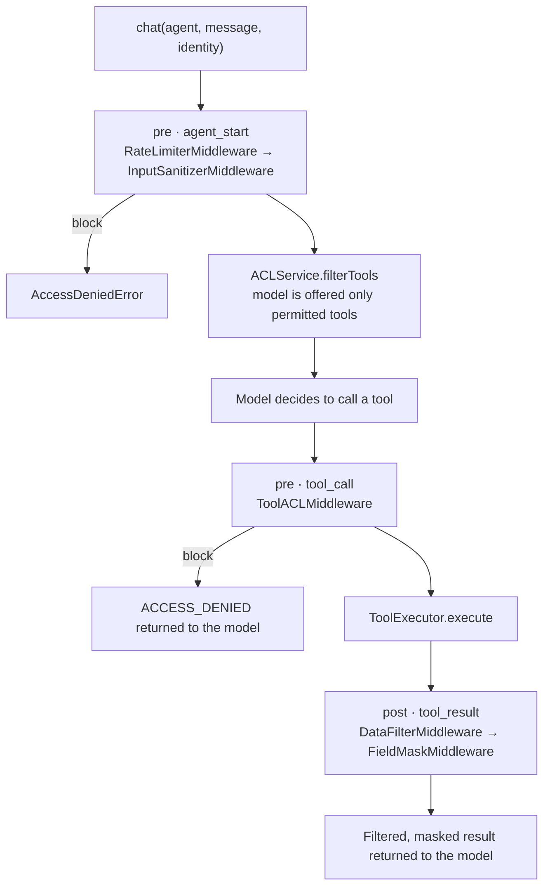

# Security and access control

In an agent system, protecting the HTTP endpoint is not enough. The model
decides which tools to call, retrieves documents and combines data from several
sources into one answer. Agent349 controls each of those points separately:
which tools the model is offered, which calls it may make, which records and
fields come back, and which documents a search may return.

All of it is driven by the caller identity passed to `chat()`:
`{ tenantId, userId, roles }`.

## The pipeline



| Middleware                 | Phase | Default priority | Applies to   |
| -------------------------- | ----- | ---------------- | ------------ |
| `RateLimiterMiddleware`    | pre   | 10               | agent start  |
| `InputSanitizerMiddleware` | pre   | 20               | agent start  |
| `ToolACLMiddleware`        | pre   | 30               | tool calls   |
| `DataFilterMiddleware`     | post  | 40               | tool results |
| `FieldMaskMiddleware`      | post  | 50               | tool results |

Lower priority runs first. The chain stops at the first `block`.

## Wiring

Register an `ACLService` and a `SecurityMiddlewareChain` once. Both are applied
to every `chat()` and to every resumed approval.

```ts
import {
  ACLService,
  DataFilter,
  DataFilterMiddleware,
  FieldMaskMiddleware,
  FieldMasker,
  InputSanitizer,
  InputSanitizerMiddleware,
  RateLimiter,
  RateLimiterMiddleware,
  SecurityMiddlewareChain,
  ToolACLMiddleware,
} from 'agent349';

const acl = new ACLService({
  policies: [
    { resourceType: 'tool', resourceId: 'hr.getEmployee', allowedRoles: ['employee', 'hr_admin'] },
    { resourceType: 'tool', resourceId: 'hr.updateSalary', allowedRoles: ['hr_admin'] },
  ],
});
const dataFilter = new DataFilter([{ scope: 'tool', filterType: 'tenant_isolation', config: {} }]);
const masker = new FieldMasker([
  { toolName: 'hr.getEmployee', field: 'salary', maskType: 'redact', visibleToRoles: ['hr_admin'] },
]);

orch.registerACLService(acl); // layer 1: filter what the model is offered

// Pass the EventBus so security decisions reach the audit trail and logs.
const chain = new SecurityMiddlewareChain(orch.events);
chain.use(
  new RateLimiterMiddleware(
    new RateLimiter({ perUser: { perMinute: 30, perHour: 500, perDay: 2_000 } }),
  ),
);
chain.use(new InputSanitizerMiddleware(new InputSanitizer()));
chain.use(new ToolACLMiddleware(acl)); // layer 2: re-check every call
chain.use(new DataFilterMiddleware(dataFilter));
chain.use(new FieldMaskMiddleware(masker));
orch.registerSecurityChain(chain);
```

> Construct the chain with `orch.events`. Without it the chain still enforces
> every rule, but its decisions (`security.acl.denied`, `security.field.masked`,
> …) are not emitted, so they do not appear in the audit trail.

Why two ACL layers? Filtering saves tokens and keeps the model from attempting
calls it cannot make. The pre-execution check also stops a call to a tool that
was never offered, whether the model hallucinated it or the permissions
changed mid-conversation.

## Tool and skill policies

```ts
import { ACLService } from 'agent349';

const acl = new ACLService();

acl.addPolicy({
  resourceType: 'tool',
  resourceId: 'admin.resetSystem',
  allowedRoles: ['it_admin'],
  deniedRoles: ['contractor'], // denial wins over allowance
});

acl.addPolicy({
  resourceType: 'tool',
  resourceId: 'reports.export',
  allowedRoles: ['analyst'],
  conditions: [{ field: 'metadata.department', operator: 'in', value: ['finance', 'audit'] }],
});

acl.addPolicy({ resourceType: 'skill', resourceId: 'payroll', allowedRoles: ['hr_admin'] });
```

Evaluation rules:

- **No policy means public.** A resource without a policy is available to any
  caller. Add a policy for every sensitive tool.
- `deniedRoles` takes precedence over `allowedRoles`.
- The role `'*'` matches any caller.
- Several policies on the same resource must **all** pass.
- Conditions read `ExecutionContext` fields with dot notation. Operators: `eq`,
  `neq`, `in`, `not_in`, `exists`, `regex`.

`acl.evaluate('tool', name, context)` returns the decision with its reason if
you need it outside an agent run.

## Data filtering

`DataFilterMiddleware` removes records from array results before the model
sees them. Single objects pass through unchanged.

```ts
import { DataFilter } from 'agent349';

const dataFilter = new DataFilter([
  { scope: 'tool', filterType: 'tenant_isolation', config: {} }, // record.tenantId must match the caller
  { scope: 'tool', filterType: 'role_based', config: {} }, // record.accessRoles must overlap the caller's roles
  {
    scope: 'tool',
    toolName: 'crm.getDeals',
    filterType: 'custom',
    config: {
      customFilter: (data, ctx) =>
        Array.isArray(data)
          ? data.filter(
              (deal: { ownerId: string }) =>
                deal.ownerId === ctx.userId || ctx.roles.includes('sales_manager'),
            )
          : data,
    },
  },
]);
```

Retrieval has its own, automatic isolation: `rag.search` always adds the
caller's `tenantId` and roles to the vector-store query, and the model cannot
override them. See [Retrieval](rag.md#access-control).

## Field masking

```ts
import { FieldMasker } from 'agent349';

const masker = new FieldMasker([
  {
    toolName: 'hr.getEmployee',
    field: 'salary',
    maskType: 'redact', // → '[REDACTED]'
    visibleToRoles: ['hr_admin'],
  },
  {
    toolName: 'billing.getCard',
    field: 'card.number', // nested fields and arrays of records are supported
    maskType: 'partial',
    visibleToRoles: ['billing_admin'],
    partialConfig: { showFirst: 0, showLast: 4, maskChar: '*' },
  },
  { toolName: 'users.search', field: 'email', maskType: 'hash', visibleToRoles: [] },
]);
```

Mask types: `redact`, `partial`, `hash` (SHA-256, truncated) and `custom`. Masking
works on a copy, so the tool's original result is never mutated.

> Data filters and mask rules take effect through `DataFilterMiddleware` and
> `FieldMaskMiddleware`, built from `DataFilter` and `FieldMasker` as shown
> above. `ACLService` also accepts `dataFilters` and `maskRules`, but those are
> applied only when you call `acl.filterToolResult()` / `acl.maskFields()`
> yourself. They are not part of the agent loop.

## Prompt injection and rate limits

`InputSanitizer` checks the user message against built-in patterns (role
overrides, injected instructions, delimiter escapes, context manipulation) in
English and Spanish. High-risk input is blocked, medium-risk input is
neutralized, and low-risk input is only reported.

`RateLimiter` applies fixed-window limits per tenant and per user before the
model is called.

Both are defense in depth, not guarantees. Pattern matching cannot recognize
every injection, and the in-memory rate limiter counts per process.

## Untrusted content

The built-in tools that read content you do not control (`web.read`,
`feed.read`, and `file.read` by default) mark their results as `untrusted`, and
your own tools can do the same with `ToolResult.untrusted`. Tools that act externally are marked
with `sideEffects`. When both occur in the same turn, the SDK emits
`security.untrusted.mutating`, which is the typical shape of an indirect
prompt-injection attack. This is **observability, not enforcement**: route
the event to your alerting, or combine it with approval triggers to require a
human decision.

## Custom middleware

```ts
import type { SecurityMiddleware } from 'agent349';
import type { SecurityMiddlewareChain } from 'agent349';

declare const chain: SecurityMiddlewareChain;

const businessHours: SecurityMiddleware = {
  name: 'business-hours',
  phase: 'pre',
  priority: 25,
  appliesTo: 'tool',
  async execute(_context, payload) {
    const hour = new Date().getUTCHours();
    if (payload.toolName === 'payments.transfer' && (hour < 8 || hour > 18)) {
      return { action: 'block', reason: 'Transfers are only allowed during business hours' };
    }
    return { action: 'continue' };
  },
};

chain.use(businessHours);
```

## Checklist

- [ ] A policy exists for every tool with sensitive data or side effects
      (resources without a policy are public).
- [ ] Both `registerACLService` and `registerSecurityChain` are used.
- [ ] The chain is constructed with `orch.events`.
- [ ] A `tenant_isolation` data filter is configured if records from several tenants can reach one tool.
- [ ] Ingested documents carry `tenantId` and `accessRoles` metadata.
- [ ] Audit is enabled, so denials are recorded.

For the full reference, including the ACL model in depth and performance
trade-offs, see the Spanish [ACL manual](../es/ACL_MANUAL.md).
